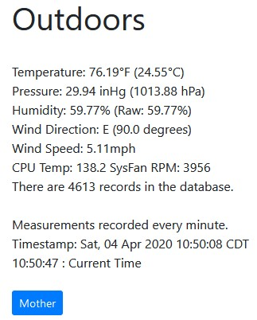

# The Quest for a Reliable, Robust, Repairable Raspberry Pi-based Weather Station

Sept. 14, 2020 NOTE: The YuHan power supply died during a lightening storm.  I replaced it with the guts from a dead inexpensive UPS and a 120VAC to 12VDC supply. I replaced the UPS's dead battery with a fresh 5AH battery (which was twice the size of the original.)  If you're interested in this build, keep this in mind.  I'll get those details updated here as soon as I can. (new photos in PICS folder)

Project Initialized October 2019.
Project opened to public on Github February 2020. As built: c.$470.00.
  

My station is up and running.  It works.  I get good, accurate, stable readings for temperature, pressure, humidity, wind speed, wind direction and rainfall. I interact with my system by means of a web browser on my desktop or phone.

This project is not an easy one, but if I can build it, so can other people.

Here's what's where:  (remember: this is all in progress still)

- **Code**: contains the Python3 code in the 'out' folder as well as the 'all' folder, which contains code for the mySQL server and browser front-end.  This folder also contains 'The_Code_is_what_it_is.md' which provides more detail on all that.
- **Component_Docs**: contains collected documentation for the various hardware pieces of the station.  The Station_Parts_List.pdf is there.
- **Pics**: contains pictures of the pieces and parts (640x480).  Contact me if you want higher resolution pics.
- **SKP_STL**: contains the Sketchup and stereolithography files for the 3D printed parts I designed for this project.
- **Station_Assembly_Docs**: contains documents pertaining to the actual assembly of the station.
  - **There are no step-by-step instructions there.**  But there is a [block diagram](./Station_Assembly_Docs/System_Block_Diagram.pdf) and a [schematic diagram](./Station_Assembly_Docs/WeatherPi_System_Schematic-V1.2.pdf).  And don't forget the Station_Parts_List.pdf in Component Docs.

This is not a quick-and-easy project.  The station is powered by a remote 12VDC power supply with a battery backup.  I dug a trench, put PVC conduit in it, and pulled 14AWG Romex into it.  It's a good solution.  I drove ground rods and put in-line lighting/surge protectors on both ends of that power run.  I used a power supply made for controlled access doors.  A benefit of doing that is it has a timed relay built in.  By routing the 12V output of the supply through that relay, I have a way to remotely power-cycle (reboot) the station.  This has been VERY handy during this development stage.

The whole Weather Station package is really two computers (and interfaces with two more the way I have it set up here).  The station acquires data from the sensors, makes necessary calculations and stores that data via WiFi to a mySQL server running in my house.  That machine also serves web interface data to end-users using Python/Flask/Jinja/Gunicorn and nginx (webserver).  Video from the Pi Camera gets sent to my Zoneminder system. That video **can** be viewed directly from the station using a web browser, but I already had Zoneminder going, so it just made sense to incorporate the feed from the WeatherPi.  The front-end server ("all" is its name) also displays the temperature and humidity in my shop.  That is gathered by another Pi with a DTH11 sensor on it.  It also writes to the mySQL database.

No guarantees are made. None. That is normal in projects such as this.

I have a pretty complete parts list and the aforementioned block diagram and wiring schematic available in the repo here.

### A bit of History

After throwing away my second Acurite weather station in only two years I decided I would build my own.  It may be cheaper to buy a more expensive commercial brand like Davis, but honestly, I'm sick of the throw-away culture when I can do something about it.

The goal of this project is to take advantage of the availability of the modular Pi and Arduino sensors and boards to create a weather station that I could repair when something died.  The Pi lives on the pole with the sensors, and communicates over WiFi.

The project is written in Python 3.

I don't try to make this system available to the Internet.  It is intended to be viewed and used locally, or by means of a VPN. I do upload data to [PWSWeather.com](https://www.pwsweather.com/), which works really well.

I am making every attempt to provide enough documentation and schematics for anyone else to duplicate what I've done.

I am a self-taught coder, as anyone with experience can plainly see.  What I know is what I've done so far works here, and provides me with reliable and accurate data as compared to all the local commercial and government data sources.  

I use Visual Studio Code in Windows.  I use Microsoft's Remote-SSH extensions to work with my code on the WeatherPi out on the pole in the backyard.  The WeatherPi stores its data in a mySQL database running on another machine in the house. I use Filezilla to keep local copies of my code when I'm done editing and testing.

The system runs on a Pi 4 Model B.  Rather than re-invent the wheel on environmental sensors, I bought [Sparkfun's SEN-08942 Weather Meters](https://www.sparkfun.com/products/8942). I have a [DROK buck-converter](./Pics/DROK-Buck-Converter-mount.jpg) DC-to-DC power board, a real-time clock module, a analog-to-digital module, and a BME280 temperature, pressure, humidity sensor module all living in the box on the pole.  A Pi Camera v2 provides a 1280x720 view of the outdoor conditions.  

I own a Prusa MK3S 3D printer which I use to make mounts and other custom parts for assembling the whole thing.  Unlike many people who seem to think you can't use Sketchup for modeling for printing, I do it all the time with no problem.  The .skp and .stl files are here for you to use as you see fit.
